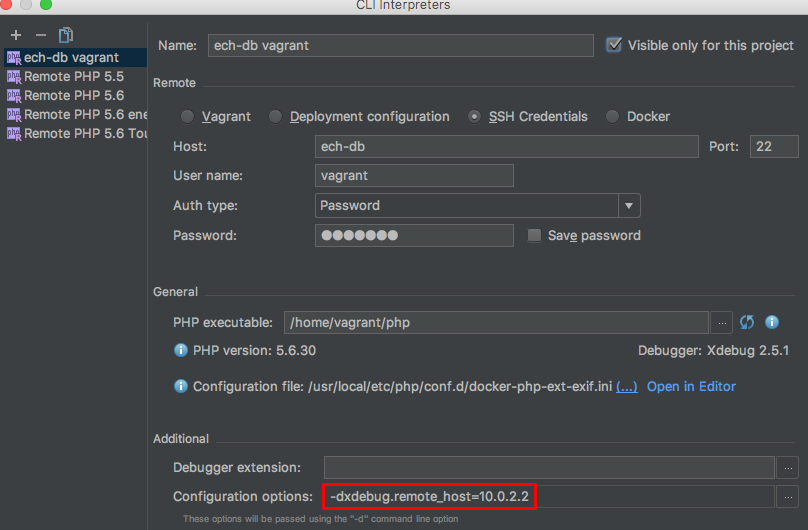
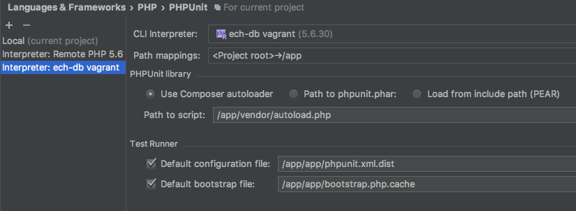

# Setting up PHPStorm

[Back to main docs](https://github.com/iwf-web/symfony-vagrant-docker-example)

### Add the server

Open Preferences and browse to Language & Frameworks > PHP > Servers. Create a new server with the name **"vagrant-docker-example"** and host **"http://symfony-vagrant-docker-example"**.
The name has to match the environment parameter **PHP_IDE_CONFIG** specified in your *docker-compose.yml* (/docker/run/docker-compose.yml). The hostname can be changed in your *vagrant_settings.yml* (/docker/vagrant/vagrant_settings.yml).

Select *"Use path mappings (select if the server is remote or symlinks are used)"* and set the absolute path for your project root folder to **"/app"** and the absolute path for the *public* subfolder to **"/app/public"**.
This should get your debugging working from the browser. Using a browser plugin like **Xdebug helper** will help you configure your browser. 

### Configure PHPUnit

If not done yet, we have to set up a remote interpreter. Do so by opening the preferences and browse to Language & Frameworks > PHP. Click on the button "..." at the end of the "CLI interpreter"-row. Click on the "+"-symbol on the upper left corner and select "From Docker, Vagrant, VM, Remote".
Your host is the one from above (**symfony-vagrant-docker-example** if you haven't changed anything). User name and password are both **vagrant**. The PHP-executable is located at **/home/vagrant/php**.

Select your remote debugger and open *Configuration options*. Add an option with *Configuration directive* **xdebug.remote_host** and value **10.0.2.2**. (It's always 10.0.2.2).

Within the preferences pane browse to Language & Frameworks > PHP > Test Frameworks. Add a new entry by selecting **PHPUnit by Remote interpreter** and select the previously created interpreter.
Configure the *Path mappings* so that your project root maps to **/app**. Your composer autoloader file resides in **/app/vendor/autoload.php**. It should find the correct PHPUnit version by clicking on the reload button on the right. Your *Default configuration file* is **/app/phpunit.xml.dist**.

### Debug command line scripts (e.g. Symfony console)

Working layer: FPM shell. (`vagrant ssh`, then `docker exec -ti fpm bash`).

To enable command line debugging simply call: 

`. enable-xdebug-cli`

To disable command line debugging call:

`. disable-xdebug-cli`

Please only activate this if you really need it, because it has negative performance impact on all PHP stuff, e.g. composer.

### Disable XDebug

Working layer: FPM shell. (`vagrant ssh`, then `docker exec -ti fpm bash`).

Sometimes you might want to completely disable Xdebug for performance reasons:

`sudo disable-xdebug-mod`

And enable it again:

`sudo enable-xdebug-mod`

